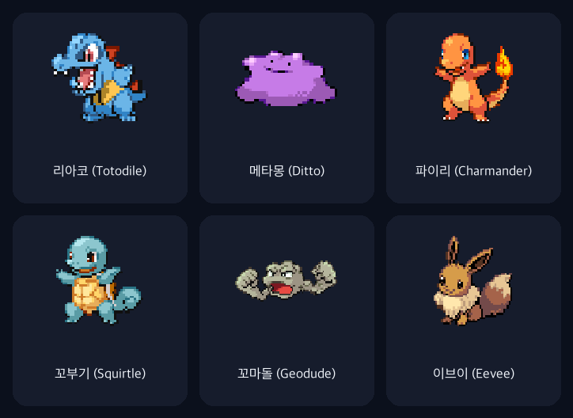

# connor-pet

실제 [Orca](https://github.com/stablyai/orca) 또는 [Claude Code](https://claude.com/claude-code)의 프로젝트/에이전트 상태에 반응하는 데스크톱 펫 — 리아코 (Totodile), 메타몽 (Ditto), 파이리 (Charmander), 꼬부기 (Squirtle), 꼬마돌 (Geodude), 이브이 (Eevee), 치코리타 (Chikorita), 아차모 (Torchic) 중 메뉴바 아이콘에서 언제든 전환 가능합니다. Orca에 임포트하는 `.codex-pet` 번들이 아니라, **완전히 별개의 macOS 앱**으로 만들었습니다. Orca/Claude Code와 다른 프로세스로 떠 있으면서, 바깥에서 그 상태를 읽어옵니다. 여기에 더해, 같은 Wi-Fi에서 앱을 켜둔 사람끼리 **디지몬 다마고치 스타일 1:1 대전**도 할 수 있습니다 (아래 "같은 wifi에서 대전하기" 참고).



## 어떻게 가능한가

메뉴바 아이콘에서 상태 소스를 **Claude Code**(기본값) 또는 **Orca** 중 고를 수 있습니다. 어느 쪽이든 `AgentStatusWatching` 프로토콜을 구현한 워처가 폴링해서 같은 우선순위 로직(`PetAnimationState.swift`의 `agentStateAnimation`, Orca의 `pet-agent-state.ts` 포팅)에 넣어 최종 애니메이션을 뽑아냅니다:

1. 하나라도 `blocked`/`waiting` → **waiting** (최우선, 즉시 확정)
2. 없고 하나라도 `working` → **running**
3. 없고 하나라도 `done` → **review**
4. 아무것도 없음 → **idle**

우선순위 로직 자체는 Orca 펫과 동일하게 포팅한 것이고, 여기에 각 상태를 포켓몬 상태이상
컨셉으로 다시 스킨했습니다: `waiting`=**얼음(Freeze)**, `review`=**헤롱헤롱(Infatuation)**,
`idle`=**잠듦(Sleep)**. `running`은 원래 그대로입니다.

마우스를 올리면 **jumping**, 드래그하면 마우스를 따라 **running-left**/**running-right**.

### Claude Code 소스 (`ClaudeCodeStatusWatcher.swift`, 기본값)

Claude Code CLI는 실행 중인 프로세스마다 `~/.claude/sessions/<pid>.json`에 자기 상태를 계속 기록합니다 (`claude agents`/`claude agents --json`이 읽는 것과 같은 파일). `ConnorPet`은 이 디렉토리를 **250ms마다** 폴링해서, 살아있는 프로세스(`kill(pid, 0)`으로 확인)의 `status`/`tempo` 필드를 Orca와 같은 `working`/`blocked`/`idle` 상태로 매핑한 뒤 동일한 `agentStateAnimation`에 넣습니다. 열려있는 **모든** Claude Code 세션(프로젝트 무관)을 집계하는 것도 Orca 소스와 동일합니다.

> **알아둘 점**: 실제로 확인해보니 이 세션 파일은 `status: "busy" | "idle"`만 안정적으로 채워지고, 더 세밀한 `tempo: "active" | "idle" | "blocked"`(권한 프롬프트 대기 등)는 이 버전(2.1.197)에서는 관찰되지 않았습니다. 이것만으로는 얼음(권한 승인 대기)·헤롱헤롱(작업 완료) 상태를 구분할 수 없어서, 아래 훅을 추가로 설치하면 더 정확한 상태를 볼 수 있습니다.

#### Claude Code 훅으로 얼음/헤롱헤롱까지 보기 (선택 사항)

세션 파일 폴링만으로는 `busy`/`idle` 두 가지만 구분되고, "권한 승인창이 떠서 멈춰있음"(얼음)이나 "작업이 끝나 리뷰를 기다림"(헤롱헤롱)에 대응하는 신호가 없습니다. 이 신호는 Claude Code의 [hooks](https://docs.claude.com/en/docs/claude-code/hooks)로만 얻을 수 있어서, 원한다면 아래처럼 직접 설정해야 합니다 — `ConnorPet`이 자동으로 설정해주지 않습니다(전역 `~/.claude/settings.json`을 건드리는 일이라 명시적으로 동의한 경우에만 건드리는 게 맞다고 판단했습니다).

**설치 (권장)** — 스크립트가 필요한 6개 훅을 `~/.claude/settings.json`에 병합해줍니다. 이미 있는 다른 훅(matcher가 걸린 것 포함)은 절대 건드리지 않고, 이 저장소가 어디 클론됐든 경로도 알아서 맞춰줍니다. 실행 전 기존 파일을 타임스탬프 붙여 백업하고, 몇 번을 다시 실행해도 중복 추가되지 않습니다:

```sh
python3 scripts/install_claude_hooks.py             # 설치
python3 scripts/install_claude_hooks.py --uninstall  # connor-pet이 추가한 항목만 제거
```

**수동 설치**를 원하면 `~/.claude/settings.json`에 아래 내용을 직접 추가해도 됩니다 (이미 다른 `hooks`가 있다면 이벤트별로 병합, 경로는 이 저장소를 클론한 실제 위치로):

```json
{
  "hooks": {
    "UserPromptSubmit": [
      { "hooks": [{ "type": "command", "command": "python3 /path/to/pet/scripts/claude_hook_status.py working" }] }
    ],
    "PreToolUse": [
      { "hooks": [{ "type": "command", "command": "python3 /path/to/pet/scripts/claude_hook_status.py working" }] }
    ],
    "PermissionRequest": [
      { "hooks": [{ "type": "command", "command": "python3 /path/to/pet/scripts/claude_hook_status.py blocked" }] }
    ],
    "Notification": [
      { "hooks": [{ "type": "command", "command": "python3 /path/to/pet/scripts/claude_hook_status.py blocked" }] }
    ],
    "Stop": [
      { "hooks": [{ "type": "command", "command": "python3 /path/to/pet/scripts/claude_hook_status.py done" }] }
    ],
    "SessionEnd": [
      { "hooks": [{ "type": "command", "command": "python3 /path/to/pet/scripts/claude_hook_status.py remove" }] }
    ]
  }
}
```

경로는 이 저장소를 클론한 실제 위치로 바꿔야 합니다. 각 훅이 하는 일:

| 훅 | 발생 시점 | 기록하는 상태 |
|---|---|---|
| `UserPromptSubmit` | 사용자가 새 프롬프트를 보냄 | `working` |
| `PreToolUse` | 도구 실행 직전 (승인 후 재개 포함) | `working` |
| `PermissionRequest` | 권한 승인창이 뜸 (Orca 자체 훅도 이 이벤트를 씀 — `Notification`보다 승인창에 특화된 신호) | `blocked` → **얼음** |
| `Notification` | 권한 승인 필요 또는 60초 이상 입력 대기 (`PermissionRequest`와 겹칠 수 있지만 놓치지 않도록 같이 걸어둠) | `blocked` → **얼음** |
| `Stop` | 에이전트가 턴을 마치고 제어권을 사용자에게 돌려줌 | `done` → **헤롱헤롱** |
| `SessionEnd` | 세션 종료 | 해당 항목 제거 |

`scripts/claude_hook_status.py`는 각 훅이 stdin으로 받는 JSON(`session_id`/`cwd` 포함)을 읽어서 `~/.claude/connor-pet-status.json`을 Orca의 `last-status.json`과 같은 형태로 갱신합니다(동시에 여러 세션이 훅을 발생시켜도 안전하도록 `fcntl.flock`으로 잠그고 원자적으로 씀). `ClaudeCodeStatusWatcher`는 이 파일이 있으면 세션 파일의 busy/idle보다 우선해서 씁니다 — 훅을 설정 안 해도 앱은 그대로 동작하고(예전처럼 busy/idle만), 설정하면 자동으로 더 정확해집니다.

**헤롱헤롱이 사라지는 시점**: `done`은 그 세션이 다시 `working`으로 바뀌기 전까지, 또는 **펫에 마우스를 올리기 전까지** 유지됩니다(둘 중 먼저 오는 쪽). 펫을 호버하면 `AgentStatusWatching.acknowledgeDone()`이 호출되어 그 시점 이전의 `done`은 전부 "확인함" 처리되고, 그 이후에 새로 `done`이 찍히면 다시 나타납니다 — Stop 이벤트 하나가 무한히 헤롱헤롱을 유지하지 않도록 하는 장치입니다.

### Orca 소스 (`OrcaStatusWatcher.swift`)

Orca의 훅 서버는 열려있는 모든 에이전트 패널의 상태를 250ms 디바운스로 디스크에 계속 저장합니다 (`src/main/agent-hooks/server/server-persistence.ts`):

```
~/Library/Application Support/Orca/agent-hooks/last-status.json
```

이 파일은 Orca 자신도 재시작 후 상태를 복구할 때 쓰는 파일이라, 바깥에서 읽어도 안전한 정식 대상입니다(해킹이 아님). 대략적인 모양:

```json
{
  "version": 2,
  "entries": {
    "<paneKey>": {
      "state": "working" | "blocked" | "waiting" | "done",
      "worktreeId": "...",
      "receivedAt": 1735000000000
    }
  }
}
```

> **주의 (실제로 부딪힌 문제)**: 실제 파일을 열어보면 항목마다 모양이 다릅니다. 예를 들어 `SubagentStop` 훅에서 온 항목은 `state`/`prompt`/`agentType`이 최상위가 아니라 `payload` 안에 중첩되어 있었습니다. 처음엔 엄격한 Codable 구조체로 파싱했는데, 이 경우 항목 하나가 예상과 다른 모양이면 **파일 전체 파싱이 실패**해서 모든 패널의 상태가 조용히 사라지는 버그가 있었습니다. 지금은 `JSONSerialization`으로 느슨하게 파싱하면서 항목마다 최상위/`payload` 둘 다 확인하도록 고쳤습니다 (`OrcaStatusWatcher.swift`).

`ConnorPet`은 이 파일을 1초마다 폴링(Orca 자신의 쓰기 주기보다 넉넉함)합니다.

### 상태별로 실제 어떻게 보이는지

리아코 기준 예시입니다 (다른 펫도 스프라이트만 다를 뿐 동일한 리스킨 로직을 그대로 씁니다):


- **idle → 잠듦**: 채도/밝기를 크게 낮추고 위로 떠오르며 사라지는 "Zzz"를 얹었습니다. 할 일이
  없을 때는 그냥 자고 있는 걸로.
- **running**: 색 변화 없이 빠른 바운스 루프 그대로 — 변경 없음.
- **waiting → 얼음**: 한 포즈에 고정(=멈춰있음)하고 각진 얼음 결정 오버레이(모서리에 삐죽
  튀어나온 조각 포함)를 씌웠습니다. 채도만 낮췄던 이전 버전보다 "완전히 멈췄음"이 훨씬 명확하게
  전달됩니다.
- **review → 헤롱헤롱**: 골드 톤 대신 핑크 톤 + 떠오르는 하트 이펙트로, "일 끝났다"는 긍정적인
  뉘앙스를 상태이상 컨셉 안에서 표현했습니다.

전부 `scripts/build_sheet.py`의 `tint()`/`desaturate()`에 더해 `draw_ice_crystal()`/
`draw_hearts()`/`draw_zzz()`로 PNG에 직접 구운 것이라, Swift 쪽 코드는 건드리지 않았습니다
(애니메이션 우선순위/재생 로직은 그대로, 스프라이트 픽셀만 다시 구운 것).

## 같은 wifi에서 대전하기 (디지몬 다마고치 스타일)

같은 Wi-Fi에 이 앱을 켜둔 사람끼리 **1:1 대전**을 할 수 있습니다 — 디지몬 다마고치처럼 대전 신청 → 상대가 수락 → 양쪽이 동시에 같은 대전 화면을 봅니다.

- 메뉴바 아이콘 → **대전** 서브메뉴에 같은 Wi-Fi에서 실행 중인 다른 앱들이 뜹니다 (없으면 "주변에 상대가 없어요").
- 상대를 고르면 그쪽에 **수락/거절** 창이 뜨고, 수락하면 양쪽에서 대전 창이 열려 두 펫이 마주 보고 발사체를 주고받으며 HP를 깎다가 **WIN!/LOSE**로 승패를 보여줍니다.

서버가 필요 없습니다. Apple의 **Network.framework**만 씁니다:

- **발견**: 각 앱이 `_connorpet._tcp` Bonjour 서비스를 광고(`NWListener`)하고 동시에 탐색(`NWBrowser`)합니다. TXT 레코드에 인스턴스 UUID·표시 이름·펫 슬러그를 실어, 자기 자신은 걸러내고 상대의 캐릭터까지 그대로 그립니다.
- **핸드셰이크**: 신청/수락/거절은 하나의 TCP 연결(`NWConnection`) 위에서 length-prefixed JSON으로 주고받습니다 (`BattleService.swift`).
- **결정론적 대전**: 수락하는 쪽이 랜덤 `seed` 하나를 정해 보내면, **양쪽이 그 seed로 똑같은 시뮬레이션**(`BattleSimulation.swift`)을 돌려 동일한 라운드·승패를 계산합니다. 프레임 단위 동기화가 필요 없어서(서로 믿을 필요도 없이) 양쪽 화면이 정확히 같은 결과를 냅니다. 역할(신청자=challenger / 수락자=accepter)이 고정이라 누가 어느 쪽에 서는지도 양쪽이 일치합니다.

> **네트워크 주의**: 게스트/회사 Wi-Fi 중 "클라이언트 격리(AP isolation)"가 켜진 곳에서는 같은 네트워크라도 기기끼리 서로 못 봅니다. 그럴 땐 집 Wi-Fi나 핫스팟에서 테스트하세요. macOS 15(Sequoia)부터는 로컬 네트워크 접근 권한 팝업이 뜰 수 있습니다(허용해야 발견됩니다).

핸드셰이크 로직은 실제 앱 없이 헤드리스로 검증할 수 있습니다 — 한 프로세스에서 두 서비스를 띄워 발견→신청→수락→결과 합의까지 확인하고 `SELFTEST PASS`를 찍습니다:

```sh
cd ConnorPet
CONNORPET_SELFTEST=battle swift run
```

## 폴더 구조

```
totodile.codex-pet/     리아코(Totodile) Orca 임포트용 번들 (Settings → Experimental → Pet → Import)
  pet.json                 매니페스트: 9행 스프라이트 레이아웃, 프레임별 타이밍
  spritesheet.png            800x1800, 4열 x 9행, 프레임 200x200

ditto.codex-pet/         메타몽(Ditto) Orca 임포트용 번들 — 위와 동일한 구조
charmander.codex-pet/    파이리(Charmander) Orca 임포트용 번들 — 위와 동일한 구조
squirtle.codex-pet/      꼬부기(Squirtle) Orca 임포트용 번들 — 위와 동일한 구조
geodude.codex-pet/       꼬마돌(Geodude) Orca 임포트용 번들 — 위와 동일한 구조
eevee.codex-pet/         이브이(Eevee) Orca 임포트용 번들 — 위와 동일한 구조
chikorita.codex-pet/     치코리타(Chikorita) Orca 임포트용 번들 — 위와 동일한 구조
torchic.codex-pet/       아차모(Torchic) Orca 임포트용 번들 — 위와 동일한 구조

scripts/build_sheet.py   재현 가능한 생성 스크립트 — `PETS` 리스트에 등록된 각 포켓몬마다
                          PokeAPI의 5세대 배틀 스프라이트를 받아서 `<slug>.codex-pet/`과
                          ConnorPet 앱의 번들 리소스를 함께 재생성합니다 (`python3 scripts/build_sheet.py`)

scripts/simulate_agent.py  실제 에이전트 없이 테스트하기 위한 도구. last-status.json에
                             가짜 패널 상태를 주입/삭제합니다 (아래 "테스트하기" 참고, Orca 소스 전용)

scripts/install_claude_hooks.py  위 훅 설정을 ~/.claude/settings.json에 자동으로 병합/제거하는
                                   설치 스크립트 (`--uninstall`로 원상복구). 기존 훅은 건드리지
                                   않고, 재실행해도 중복 추가되지 않음

scripts/claude_hook_status.py  Claude Code 훅 핸들러 (선택 설치, 위 스크립트가 참조). ~/.claude/
                                 settings.json에 등록해두면 훅이 발생할 때마다 이 스크립트가
                                 실행되어 ~/.claude/connor-pet-status.json을 갱신합니다 (위
                                 "Claude Code 훅으로 얼음/헤롱헤롱까지 보기" 참고)

preview/index.html        브라우저 전용 미리보기: 실제 spritesheet.png + pet.json을 그대로
                            불러와서 Orca의 실제 CSS 스텝핑 알고리즘(buildSpriteAnimationCss)으로
                            재생. 여러 프로젝트/에이전트를 흉내내는 컨트롤 패널 포함. Orca 설치 불필요.

ConnorPet/                 진짜 결과물: 독립 실행형 macOS 앱
  Package.swift              (Swift Package, `swift run`만 있으면 됨 — Xcode 불필요)
  Sources/ConnorPet/
    OrcaStatusWatcher.swift    last-status.json 폴링(1s) + 전체 상태 집계 (Orca 소스)
    ClaudeCodeStatusWatcher.swift  ~/.claude/sessions/*.json + (있다면) 훅이 쓴 connor-pet-status.json을
                                    250ms마다 폴링해 병합 (Claude Code 소스, 기본값)
    PetAnimationState.swift    포팅한 우선순위 로직 + 드래그 방향 판정 + AgentStatusWatching 프로토콜
                                (acknowledgeDone()으로 헤롱헤롱 호버-해제 처리)
    SpriteSheet.swift           spritesheet.png를 애니메이션별 프레임 배열로 자름
    PetView.swift                프레임 렌더링, 호버/드래그 처리
    PetWindow.swift               테두리 없는 투명, 항상 위에 뜨는 NSWindow
    BattleService.swift            같은 wifi 발견(Bonjour, NWListener/NWBrowser) + 대전 신청/수락 핸드셰이크
    BattleSimulation.swift         seed 하나로 양쪽이 똑같이 계산하는 결정론적 대전 시뮬레이션
    BattleWindow.swift             1:1 대전 화면 (두 펫이 마주 보고 발사체 교환 + HP + WIN/LOSE)
    BattleSelfTest.swift           CONNORPET_SELFTEST=battle 로 도는 헤드리스 핸드셰이크 검증
    AppDelegate.swift              전체 연결 + 메뉴바 포켓몬 선택/상태 소스/대전/Quit 메뉴
    Resources/pets/<slug>/          펫별 spritesheet.png + pet.json 번들 사본 (totodile, ditto, charmander, squirtle, geodude, eevee, chikorita, torchic)
```

## 실행 방법

```sh
cd ConnorPet
swift run
```

메뉴바에 작은 포켓볼 아이콘이 생깁니다. 클릭하면 위쪽엔 리아코(Totodile)/메타몽(Ditto)/파이리(Charmander)/꼬부기(Squirtle)/꼬마돌(Geodude)/이브이(Eevee)/치코리타(Chikorita)/아차모(Torchic) 중 원하는 펫을, 그 아래엔 상태 소스로 **Claude Code**(기본값)/**Orca** 중 하나를 고를 수 있고(체크 표시가 각각 현재 선택), 그 아래 **대전**으로 같은 Wi-Fi의 상대에게 대전을 신청하고(위 "같은 wifi에서 대전하기" 참고), 맨 아래 Quit으로 종료합니다. 두 선택 모두 다음 실행 때도 그대로 복원됩니다. 펫 자체는 화면 우측 하단 근처에 떠서 다른 창들 위에, 모든 Space에서 보입니다. 선택한 소스가 안 깔려있거나 활동 중인 세션/패널이 없으면 그냥 idle 상태로 가만히 있습니다.

크기는 Orca 자체 기본값(`PET_SIZE_DEFAULT=180`)보다 작게, `90pt`로 맞춰뒀습니다 (`AppDelegate.swift`의 `petSize`). 더 키우거나 줄이고 싶으면 이 값만 바꾸면 됩니다.

## 테스트하기 (실제 에이전트 없이)

`scripts/simulate_agent.py`는 **Orca 소스**용입니다 (메뉴에서 소스를 Orca로 바꾼 뒤 사용):

```sh
python3 scripts/simulate_agent.py set web-app working
python3 scripts/simulate_agent.py set api-server blocked   # 펫이 즉시 "waiting"으로
python3 scripts/simulate_agent.py clear api-server         # "running"으로 복귀
python3 scripts/simulate_agent.py clear-all                # "idle"로 복귀
```

`connor-pet-test:` 접두어가 붙은 키로만 기록해서, 실제 Orca 패널(UUID 형태)과 절대 충돌하지 않습니다. `clear-all`도 이 접두어가 붙은 항목만 지웁니다.

**Claude Code 소스**는 시뮬레이터가 없습니다 — 다른 터미널에서 `claude`를 실행해서 실제 세션을 하나 띄우고 프롬프트를 보내보면(`~/.claude/sessions/<pid>.json`의 `status`가 `busy`로 바뀌는 동안) 펫이 바로 반응하는 걸 볼 수 있습니다. 위 훅까지 설정했다면 stdin으로 가짜 페이로드를 직접 넣어서 얼음/헤롱헤롱도 트리거해볼 수 있습니다:

```sh
echo '{"session_id":"<아무-id>","cwd":"/tmp"}' | python3 scripts/claude_hook_status.py blocked  # "waiting"으로
echo '{"session_id":"<아무-id>","cwd":"/tmp"}' | python3 scripts/claude_hook_status.py done      # "review"로
rm ~/.claude/connor-pet-status.json                                                              # 원상복구
```

**한 가지 알아둘 점**: Orca가 실제로 돌고 있고 실제 에이전트 활동이 생기면, Orca 자신이 다음 상태를 저장할 때 파일 전체를 자기 메모리 상태로 덮어써서 주입해둔 테스트 항목이 사라질 수 있습니다(실제로 테스트하다가 이렇게 됐습니다). 그럴 땐 그냥 `set` 명령을 다시 실행하면 됩니다 — 실제 데이터를 건드리는 게 아니라서 안전합니다.

동작 확인 로그를 보고 싶으면:
```sh
CONNORPET_DEBUG=1 swift run
```
어떤 패널이 어떤 규칙으로 최종 애니메이션을 결정했는지 stderr에 한 줄씩 찍힙니다.

## Orca 안에서 직접 쓰고 싶다면

Orca 자체 펫으로 쓰고 싶으면(Settings → Experimental → Pet → Import), 원하는 펫의 `<slug>.codex-pet/` 폴더(`totodile`/`ditto`/`charmander`/`squirtle`/`geodude`/`eevee`/`chikorita`/`torchic`)를 그대로 임포터에 지정하면 됩니다.

## 스프라이트 시트 다시 만들기

```sh
pip install pillow
python3 scripts/build_sheet.py
```

`scripts/build_sheet.py`의 `PETS` 리스트에 등록된 각 포켓몬(현재 리아코 #158, 메타몽 #132, 파이리 #4, 꼬부기 #7, 꼬마돌 #74, 이브이 #133, 치코리타 #152, 아차모 #255)마다 PokeAPI에서 5세대 애니메이션 배틀 스프라이트를 다시 받아서 `<slug>.codex-pet/{spritesheet.png,pet.json}`과 `ConnorPet/Sources/ConnorPet/Resources/pets/<slug>/`의 앱 번들 사본을 동시에 처음부터 재생성합니다 — 완전히 재현 가능하고, 바이너리 원본 에셋은 저장소에 커밋하지 않습니다. 새 포켓몬을 펫 선택 메뉴에 추가하려면 `PETS`에 항목을 하나 더 넣고 스크립트를 다시 돌린 뒤, `AppDelegate.swift`의 `availablePetSlugs`에 슬러그를 추가하면 됩니다.

## 크레딧 / 라이선스

캐릭터 스프라이트는 Nintendo/Game Freak/Creatures Inc.의 포켓몬 에셋을 [PokeAPI](https://pokeapi.co/) 경유로 가져온 것으로, 개인/데모 용도로만 사용하고 독립된 에셋으로 재배포하지 않습니다. 그 외 이 저장소의 모든 코드(빌드 스크립트, Swift 앱, 미리보기 페이지)는 자유롭게 재사용해도 됩니다.
