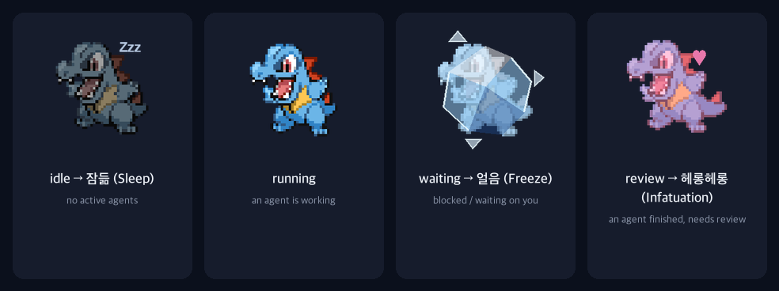

# connor-pet

실제 [Orca](https://github.com/stablyai/orca)의 프로젝트/에이전트 상태에 반응하는 데스크톱 펫 — 리아코 (Totodile, #158). Orca에 임포트하는 `.codex-pet` 번들이 아니라, **완전히 별개의 macOS 앱**으로 만들었습니다. Orca와 다른 프로세스로 떠 있으면서, 바깥에서 Orca의 상태를 읽어옵니다.

## 어떻게 가능한가

Orca의 훅 서버는 열려있는 모든 에이전트 패널의 상태를 250ms 디바운스로 디스크에 계속 저장합니다 (`src/main/agent-hooks/server/server-persistence.ts`):

```
~/Library/Application Support/Orca/agent-hooks/last-status.json
```

이 파일은 Orca 자신도 재시작 후 상태를 복구할 때 쓰는 파일이라, 바깥에서 읽어도 안전한 정식 대상입니다(해킹이 아님). 대략적인 모양:

```json
{
  "version": 2,
  "entries": {
    "<paneKey>": {
      "state": "working" | "blocked" | "waiting" | "done",
      "worktreeId": "...",
      "receivedAt": 1735000000000
    }
  }
}
```

> **주의 (실제로 부딪힌 문제)**: 실제 파일을 열어보면 항목마다 모양이 다릅니다. 예를 들어 `SubagentStop` 훅에서 온 항목은 `state`/`prompt`/`agentType`이 최상위가 아니라 `payload` 안에 중첩되어 있었습니다. 처음엔 엄격한 Codable 구조체로 파싱했는데, 이 경우 항목 하나가 예상과 다른 모양이면 **파일 전체 파싱이 실패**해서 모든 패널의 상태가 조용히 사라지는 버그가 있었습니다. 지금은 `JSONSerialization`으로 느슨하게 파싱하면서 항목마다 최상위/`payload` 둘 다 확인하도록 고쳤습니다 (`OrcaStatusWatcher.swift`).

`ConnorPet`은 이 파일을 1초마다 폴링(Orca 자신의 쓰기 주기보다 넉넉함)해서, Orca 펫이 쓰는 것과 같은 우선순위 로직(`pet-agent-state.ts`의 `agentStateAnimation`)을 열려있는 **모든** 프로젝트/패널에 대해 그대로 돌립니다:

1. 하나라도 `blocked`/`waiting` → **waiting** (최우선, 즉시 확정)
2. 없고 하나라도 `working` → **running**
3. 없고 하나라도 `done` → **review**
4. 아무것도 없음 → **idle**

마우스를 올리면 **jumping**, 드래그하면 마우스를 따라 **running-left**/**running-right**.

### 상태별로 실제 어떻게 보이는지



`idle`과 `running`은 색이 아니라 주로 움직임(느린 숨쉬기 vs 빠른 바운스)으로 구분돼서,
정지 이미지로 보면 실제로 움직일 때보다 더 비슷해 보입니다. `waiting`은 채도를 낮췄고
`review`는 따뜻한 골드 톤이 들어갑니다 — 둘 다 `codex-pet-sprite-defaults.ts`의 행별
처리를 그대로 포팅한 것입니다.

## 폴더 구조

```
totodile.codex-pet/     Orca에 직접 임포트 가능한 진짜 번들 (Settings → Experimental → Pet → Import)
  pet.json                 매니페스트: 9행 스프라이트 레이아웃, 프레임별 타이밍
  spritesheet.png            800x1800, 4열 x 9행, 프레임 200x200

scripts/build_sheet.py   재현 가능한 생성 스크립트 — PokeAPI의 5세대 배틀 스프라이트를
                          다시 받아서 처음부터 시트를 만듭니다 (`python3 scripts/build_sheet.py`)

scripts/simulate_agent.py  실제 에이전트 없이 테스트하기 위한 도구. last-status.json에
                             가짜 패널 상태를 주입/삭제합니다 (아래 "테스트하기" 참고)

preview/index.html        브라우저 전용 미리보기: 실제 spritesheet.png + pet.json을 그대로
                            불러와서 Orca의 실제 CSS 스텝핑 알고리즘(buildSpriteAnimationCss)으로
                            재생. 여러 프로젝트/에이전트를 흉내내는 컨트롤 패널 포함. Orca 설치 불필요.

ConnorPet/                 진짜 결과물: 독립 실행형 macOS 앱
  Package.swift              (Swift Package, `swift run`만 있으면 됨 — Xcode 불필요)
  Sources/ConnorPet/
    OrcaStatusWatcher.swift    last-status.json 폴링 + 전체 상태 집계
    PetAnimationState.swift    포팅한 우선순위 로직 + 드래그 방향 판정
    SpriteSheet.swift           spritesheet.png를 애니메이션별 프레임 배열로 자름
    PetView.swift                프레임 렌더링, 호버/드래그 처리
    PetWindow.swift               테두리 없는 투명, 항상 위에 뜨는 NSWindow
    AppDelegate.swift              전체 연결 + 메뉴바 Quit 항목
    Resources/                     spritesheet.png + pet.json 번들 사본
```

## 실행 방법

```sh
cd ConnorPet
swift run
```

메뉴바에 작은 포켓볼 아이콘이 생깁니다 (우클릭 → Quit으로 종료). 펫 자체는 화면 우측 하단 근처에 떠서 다른 창들 위에, 모든 Space에서 보입니다. Orca가 안 깔려있거나 활동 중인 패널이 없으면 그냥 idle 상태로 가만히 있습니다.

크기는 Orca 자체 기본값(`PET_SIZE_DEFAULT=180`)보다 작게, `90pt`로 맞춰뒀습니다 (`AppDelegate.swift`의 `petSize`). 더 키우거나 줄이고 싶으면 이 값만 바꾸면 됩니다.

## 테스트하기 (실제 에이전트 없이)

```sh
python3 scripts/simulate_agent.py set web-app working
python3 scripts/simulate_agent.py set api-server blocked   # 펫이 즉시 "waiting"으로
python3 scripts/simulate_agent.py clear api-server         # "running"으로 복귀
python3 scripts/simulate_agent.py clear-all                # "idle"로 복귀
```

`connor-pet-test:` 접두어가 붙은 키로만 기록해서, 실제 Orca 패널(UUID 형태)과 절대 충돌하지 않습니다. `clear-all`도 이 접두어가 붙은 항목만 지웁니다.

**한 가지 알아둘 점**: Orca가 실제로 돌고 있고 실제 에이전트 활동이 생기면, Orca 자신이 다음 상태를 저장할 때 파일 전체를 자기 메모리 상태로 덮어써서 주입해둔 테스트 항목이 사라질 수 있습니다(실제로 테스트하다가 이렇게 됐습니다). 그럴 땐 그냥 `set` 명령을 다시 실행하면 됩니다 — 실제 데이터를 건드리는 게 아니라서 안전합니다.

동작 확인 로그를 보고 싶으면:
```sh
CONNORPET_DEBUG=1 swift run
```
어떤 패널이 어떤 규칙으로 최종 애니메이션을 결정했는지 stderr에 한 줄씩 찍힙니다.

## Orca 안에서 직접 쓰고 싶다면

Orca 자체 펫으로 리아코를 쓰고 싶으면(Settings → Experimental → Pet → Import), `totodile.codex-pet/` 폴더를 그대로 임포터에 지정하면 됩니다.

## 스프라이트 시트 다시 만들기

```sh
pip install pillow
python3 scripts/build_sheet.py
```

PokeAPI에서 리아코의 5세대 애니메이션 배틀 스프라이트를 다시 받아서 `totodile.codex-pet/{spritesheet.png,pet.json}`을 처음부터 재생성합니다 — 완전히 재현 가능하고, 바이너리 원본 에셋은 저장소에 커밋하지 않습니다.

## 크레딧 / 라이선스

캐릭터 스프라이트는 Nintendo/Game Freak/Creatures Inc.의 포켓몬 에셋을 [PokeAPI](https://pokeapi.co/) 경유로 가져온 것으로, 개인/데모 용도로만 사용하고 독립된 에셋으로 재배포하지 않습니다. 그 외 이 저장소의 모든 코드(빌드 스크립트, Swift 앱, 미리보기 페이지)는 자유롭게 재사용해도 됩니다.
